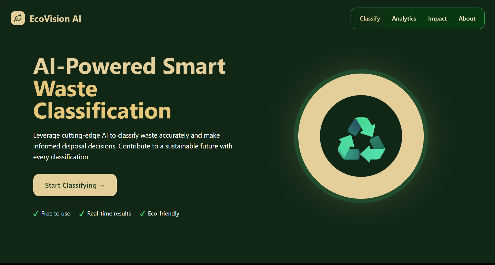
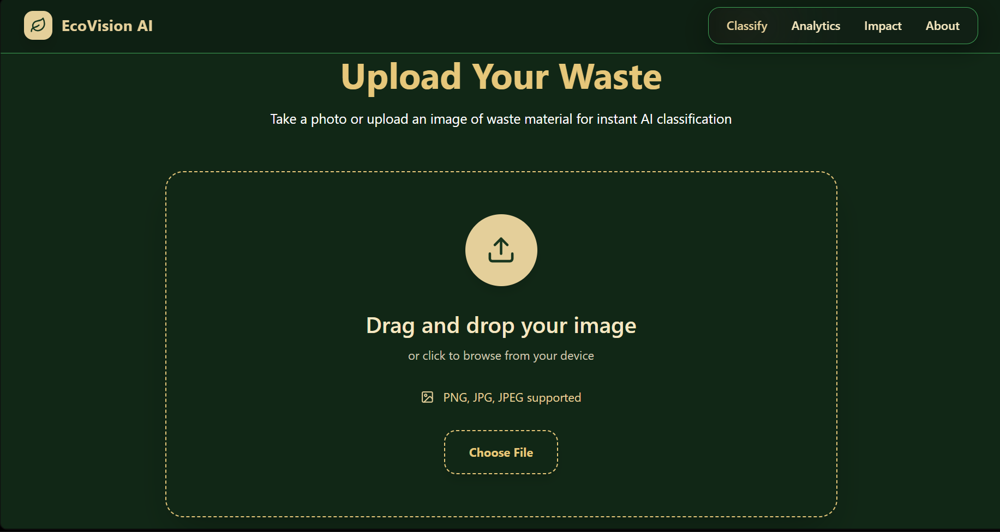
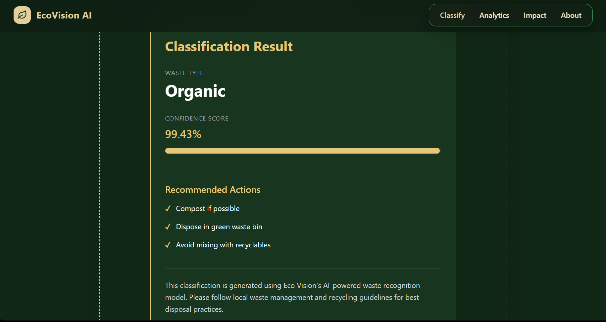

# 🌱 Eco Vision – AI-Powered Waste Classification System

Eco Vision is an intelligent waste classification platform that leverages Deep Learning to identify whether waste materials are **Organic** or **Recyclable**. The platform enables users to upload waste images and receive instant AI-powered predictions, confidence scores, and disposal recommendations to promote responsible waste management and environmental sustainability.

---

## 🎯 Key Highlights

* Achieved **92.04% Test Accuracy** using MobileNetV2 Transfer Learning
* AI-powered waste classification
* Real-time image prediction
* Confidence score visualization
* Waste disposal recommendations
* Responsive modern user interface
* React + Flask full-stack architecture
* TensorFlow/Keras model integration

---

## 🚀 Features

### AI Classification

* Organic Waste Detection
* Recyclable Waste Detection
* Deep Learning-Based Prediction
* Confidence Score Generation

### User Experience

* Image Upload Interface
* Instant Prediction Results
* Responsive Design
* Interactive User Interface

### Sustainability Support

* Waste Segregation Awareness
* Disposal Recommendations
* Environmentally Responsible Decision Making

---

## 🛠️ Technology Stack

### Frontend

* React.js
* Tailwind CSS
* Axios
* Lucide React Icons

### Backend

* Flask
* Flask-CORS

### Artificial Intelligence

* TensorFlow
* Keras
* MobileNetV2
* Transfer Learning
* NumPy
* Pillow (PIL)

---

## 🧠 Model Architecture

The waste classification model is built using **MobileNetV2** pre-trained on ImageNet and fine-tuned using Transfer Learning.

### Training Configuration

| Parameter         | Value               |
| ----------------- | ------------------- |
| Base Architecture | MobileNetV2         |
| Input Size        | 224 × 224           |
| Batch Size        | 32                  |
| Epochs            | 10                  |
| Optimizer         | Adam                |
| Loss Function     | Binary Crossentropy |
| Classes           | Organic, Recyclable |

### Model Statistics

| Metric                   | Value     |
| ------------------------ | --------- |
| Total Parameters         | 2,422,081 |
| Trainable Parameters     | 164,097   |
| Non-Trainable Parameters | 2,257,984 |

### Performance Metrics

| Metric              | Value      |
| ------------------- | ---------- |
| Test Accuracy       | **92.04%** |
| Test Loss           | **0.2018** |
| Validation Accuracy | **92.04%** |
| Validation Loss     | **0.2018** |

---

## 📂 Project Structure

```text
eco-vision/
│
├── frontend/
│   ├── src/
│   ├── public/
│   └── package.json
│
├── backend/
│   ├── app.py
│   ├── waste_classifier.keras
│   └── requirements.txt
│
└── README.md
```

---

## ⚙️ Installation & Setup

### Clone Repository

```bash
git clone https://github.com/Subham-Das1/eco-vision.git

cd eco-vision
```

---

### Backend Setup

```bash
cd backend

python -m venv venv

venv\Scripts\activate

pip install -r requirements.txt

python app.py
```

Backend Server:

```text
http://localhost:5000
```

---

### Frontend Setup

```bash
cd frontend

npm install

npm run dev
```

Frontend Application:

```text
http://localhost:5173
```

---

## 🔄 Application Workflow

1. User uploads a waste image.
2. React frontend sends the image to the Flask backend.
3. Flask preprocesses the image.
4. TensorFlow model performs inference.
5. Prediction and confidence score are generated.
6. Results are returned to the frontend.
7. Eco Vision displays classification and disposal recommendations.

---

## 🌍 Environmental Impact

Eco Vision promotes sustainable waste management by helping users:

* Improve waste segregation practices
* Reduce landfill contamination
* Increase recycling awareness
* Encourage responsible disposal behavior
* Support sustainability initiatives

---

## 📸 Screenshots

### Home Page



### Waste Upload Interface



### Classification Result



---

## 🔮 Future Enhancements

* Multi-Class Waste Classification
* Plastic Detection
* Glass Detection
* Metal Detection
* Paper Detection
* E-Waste Recognition
* Camera-Based Real-Time Classification
* Cloud Deployment
* Mobile Application
* Location-Based Recycling Guidance

---

## 👨‍💻 Author

### Subham Das

B.Tech Graduate | Full Stack Developer | AI Enthusiast

GitHub:
https://github.com/Subham-Das1

---

## 📜 License

This project is intended for educational, research, and portfolio purposes.
